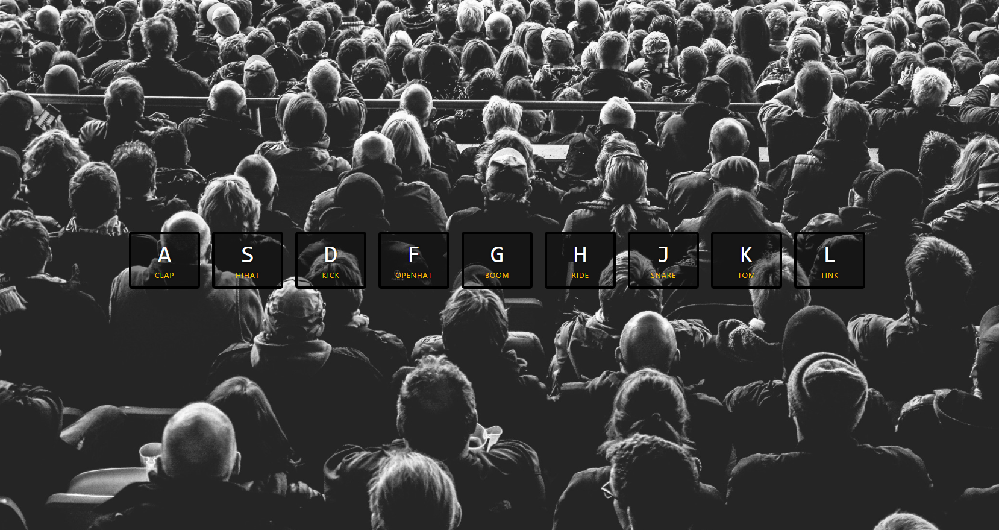

# 자바 스크립트 30개 미니 프로젝트 만들기 - 1 Drum Kit

* JS 30개 프로젝트 만들기. [Wes Bos님 강의](https://www.youtube.com/watch?v=VuN8qwZoego&list=PLu8EoSxDXHP6CGK4YVJhL_VWetA865GOH)

## Drum Kit



* data key값으로 오디오를 불러오는 것이 핵심.

* key와 audio에 대해 각 event 속성을 불러 control
* event를 트리거로 classList를 통해 class를 추가, 제거시키므로써 입력에 대한 제어를 가능케 함.

```
const div = document.createElement('div');
div.className = 'foo';

// our starting state: <div class="foo"></div>
console.log(div.outerHTML);

// use the classList API to remove and add classes
div.classList.remove("foo");
div.classList.add("anotherclass");

// <div class="anotherclass"></div>
console.log(div.outerHTML);

// if visible is set remove it, otherwise add it
div.classList.toggle("visible");

// add/remove visible, depending on test conditional, i less than 10
div.classList.toggle("visible", i < 10 );

console.log(div.classList.contains("foo"));

// add or remove multiple classes
div.classList.add("foo", "bar", "baz");
div.classList.remove("foo", "bar", "baz");

// add or remove multiple classes using spread syntax
const cls = ["foo", "bar"];
div.classList.add(...cls);
div.classList.remove(...cls);

// replace class "foo" with class "bar"
div.classList.replace("foo", "bar");
```
