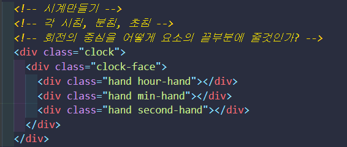
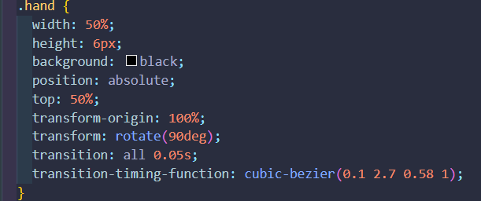
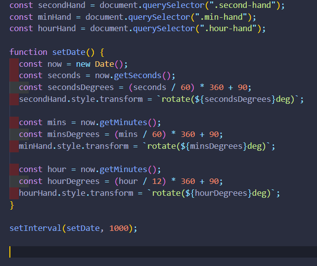

# 자바 스크립트 30개 미니 프로젝트 만들기 - 2.Analog Clock

* JS 30개 프로젝트 만들기. [Wes Bos님 강의](https://www.youtube.com/watch?v=VuN8qwZoego&list=PLu8EoSxDXHP6CGK4YVJhL_VWetA865GOH)

## 2.Analog Clock

* 제어해야 될 요소들 (시침, 분침, 초침)

* transform-origin 은 0퍼센트일경우 왼쪽 끝이 축, 100퍼센트는 오른쪽 끝이 축.(변환원점)
  * 하나 더주면 상하 축까지 조정.
* 축을 기준으로 rotate
* 움직임은 0.05초 동안 유지
* transition-timing-function
  * transition의 진행속도를 조절한다.
  * east. linear, ease-in, ease-out, initial, inherit ...

* 각 시계침들을 요소로 1초마다 set Date를 불러 업데이트.(setInterval)

* now 날짜 객체의 시, 분.. 위 코드는 오타. hour은 getHour로 받아옴. 원본은 수정

* setInterval과 setTimeout의 차이.

  * **setInterval 함수** : 일정한 시간 간격으로 작업을 수행하기 위해서 사용.
    * clearInterval 함수를 사용하여 중지 
    * 작업의 수행시간이 시간 간격보다 길경우에 주의
  * **setTimeout 함수** : 일정한 시간 후에 작업을 한번 실행.
    * 보통 재귀적 호출을 사용하여 작업을 반복. 
    * setInterval 과는 달리 지정된 시간을 기다린후 작업을 수행하고, 다시 일정한 시간을 기다린후 작업을 수행하는 방식. 
    * 지정된 시간 사이에 작업 시간이 추가. clearTimeout() 을 사용해서 작업을 중지.

  

  **- clearInterval(), clearTimeout()**이 실행중인 작업을 중지시키는 것은 아님

  *  지정된 작업은 모두 실행되고 다음 작업 스케쥴이 중지 되는 것.

  

