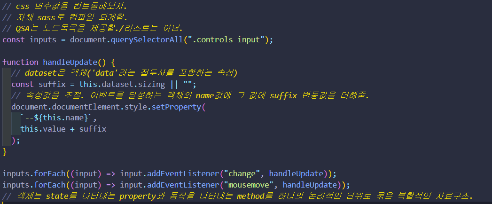
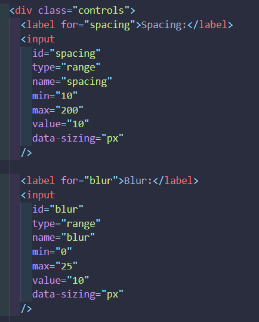
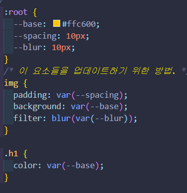

# CSS 변수 제어하기.

어떤 속성값을 제어할 것이냐? name에 부여한 style의 spacing과 blur속성을 제어한다.

## this 키워드

동작을 나타내는 메서드는 객체의 state 즉 property를 참조하고 변경할 수 있어야한다.

이때 메서드가 자신이 속한 객체의 프로퍼티를 참조하려면 먼저 자신이 속한 객체를 가리키는 식별자를 참조할 수 있어야 한다.(객체 내부의 메서드가 객체를 참조할 수 있어야 제어가 가능)

this는 자신이 속한 객체 또는 자신이 생성할 인스턴스를 가리키는 자기 참조 변수.

this를 통해 자신이 속한 객체 똔느 생성할 인스턴스의 프로퍼티나 메서드를 참조.

**this는 함수가 실행됨과 동시에 함수내부에 선언됨**

> 객체 내 메서드에서만 의미를 가지지 일반 함수에서는 undefined다.

lexical scope는 함수 객체가 생성되는 시범에 상위 스코프를 결정하지만 this 바인딩은 함수 '호출'시점에 결정된다.

호출 방식에 따라 this도 동적으로 결정

* 일반 함수 호출(중첩함수, 콜백함수 포함)
  * 전역객체가 바인딩 됨.(window객체)
* 메서드 호출
  * 메서드를 호출한 객체 obj
* 생성자 함수 호출
  * new 연산자로 생성된(생성될) 인스턴스.
* Function.prototype.apply/call/bind 메서드에 의한 간접호출
  * 인수 bar에 의해 결정됨.

