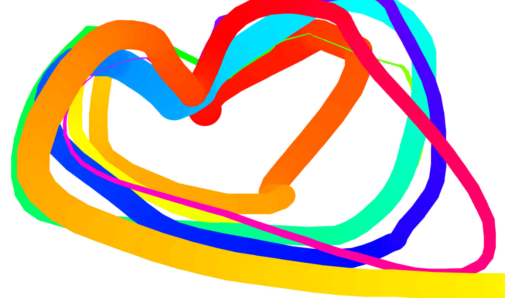

# HTML5_Canvas



## 1. Canvas

```html
<canvas id="draw" width="800" height="800"></canvas>
```

* canvas 태그. 그림을 그릴 수 있다.


## 2. 변수 설정

### 고정변수

```js
const canvas = document.querySelector("#draw");
const ctx = canvas.getContext("2d");
canvas.width = window.innerWidth;
canvas.height = window.innerHeight;
ctx.strokeStyle = "#BADASS";
ctx.lineJoin = "round";
ctx.lineCap = "round";
ctx.lineWidth = 100;
ctx.globalCompositeOperation = "multiply";
```

* canvax의 속성을 정하고 line의 속성을 정한다.

### 유동 변수

```js
let isDrawing = false;
let lastX = 0;
let lastY = 0;
let hue = 0;
let direction = true;
```

* 이벤트를 핸들링할 변수들(상태값, 좌표값, 색상값 등)

## 3. 이벤트 핸들러

```js
canvas.addEventListener("mousemove", draw);
canvas.addEventListener("mousedown", (e) => {
        isDrawing = true;
        // 마우스 클릭했을때 라스트 좌표 업데이트
        [lastX, lastY] = [e.offsetX, e.offsetY];
      });
canvas.addEventListener("mouseup", () => (isDrawing = false));
canvas.addEventListener("mouseout", () => (isDrawing = false));
```

* 마우스를 움직일떄, 클릭한 상태, 클릭하지 않은상태, 마우스가 벗어난 상태에 따라 이벤트의 상태를 핸들링함.


## 4. 그리기 함수

```js
function draw(e) {
        // console.log(e);
        // 클릭안돼있으면 돌아가~
        if (!isDrawing) return;
        ctx.strokeStyle = `hsl(${hue}, 100%, 50%)`;
        ctx.beginPath();
        // start from
        ctx.moveTo(lastX, lastY);
        // go to
        ctx.lineTo(e.offsetX, e.offsetY);
        ctx.stroke();
        [lastX, lastY] = [e.offsetX, e.offsetY];
        hue++;
        if (hue >= 360) {
          hue = 0;
        }
        // 굵기가 일정 이상 혹은 이하가 되면 방향성 toggle
        if (ctx.lineWidth >= 100 || ctx.lineWidth <= 1) {
          direction = !direction;
        }
        if (direction) {
          ctx.lineWidth++;
        } else {
          ctx.lineWidth--;
        }
      }
```

* canvas 내 좌표값을 마우스가 이동하는 offsetX,Y좌표에 따라 핸들링해 그림을 그린다. 색상에 대한 변경과 direction toggle이 좀 더 우리를 즐겁게 만드는 요소이다.

