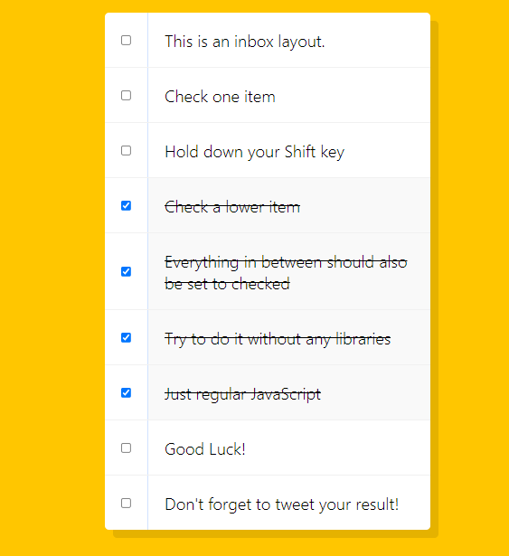

# 10 Hold Shift and Checkboxes

https://youtu.be/RIPYsKx1iiU




## 1. checkboxes

```html
 <div class="inbox">
      <div class="item">
        <input type="checkbox" />
        <p>This is an inbox layout.</p>
      </div>
      <div class="item">
        <input type="checkbox" />
        <p>Check one item</p>
      </div>
```

* inbox라는 박스안에 각 checkbox가 존재.

## 2. e.shiftKey

```js
      const checkboxes = document.querySelectorAll(
        '.inbox input[type="checkbox"]'
      );

      let lastChecked;

      function handlecheck(e) {
        let inBetween = false;
        if (e.shiftKey && this.checked) {
          checkboxes.forEach((checkbox) => {
            if (checkbox === this || checkbox === lastChecked) {
              inBetween = !inBetween;
            }

            if (inBetween) {
              checkbox.checked = true;
            }
          });
        }
        lastChecked = this;
      }
      checkboxes.forEach((checkbox) =>
        checkbox.addEventListener("click", handlecheck)
      );
```

* checkbox들을 queryselector로 묶는다.
* 결국 맨 아래 클릭 이벤트를 통해 handlecheck함수를 실행시키고
* click으로 발생한 이 이벤트는 shiftKey를 누른상태에서 checked가 발생하면
* 각각의 checkbox들에 대해 체크한 부분부터 마지막 체크한 부분까지(this는 click event) inBetween을 false에서 true로 바꾸고 true로 바뀐 checkbox의 checked속성을 true로 바꾼다.
* 이에따라 최초클릭과 마지막 클릭 사이의 elements들에 대해 forEach반복으로 전부 checked=true속성을 가지게된다.

