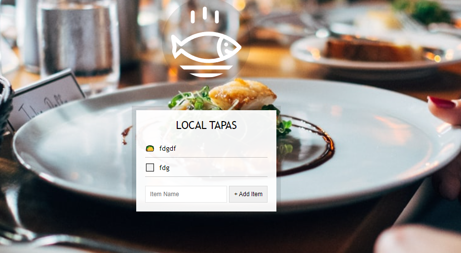

# Local Storage

* local storage
* 이벤트 위임.



<br>

<br>

## form

* to-do list를 작성해 보낼 form

```html
    <div class="wrapper">
      <h2>LOCAL TAPAS</h2>
      <p></p>
      <ul class="plates">
        <li>Loading Tapas...</li>
      </ul>
      <form class="add-items">
        <input type="text" name="item" placeholder="Item Name" required />
        <input type="submit" value="+ Add Item" />
      </form>
    </div>
```

<br>

<br>

## DOM

* 각 Markup에 대응할 객체

```js
      const addItems = document.querySelector(".add-items");
      const itemsList = document.querySelector(".plates");
      const items = JSON.parse(localStorage.getItem("items")) || [];
```

<br>

<br>

## AddItem

* form의 submit event마다 리렌더링을 막고 localstorage를 갱신시켜줌(items)

```js
      function addItem(e) {
        // 제출 누를때마다 페이지 새로 랜더링(리로드)되는 것 막음. (외부나 서버에 데이터를 보낼땐 자동)
        // 우리는 client 단에서 끝낼 것 이므로 막아줌.
        e.preventDefault();
        const text = this.querySelector("[name=item]").value;
        const item = {
          text,
          done: false
        };
        // console.log(item);
        items.push(item);
        populateList(items, itemsList);
        localStorage.setItem("items", JSON.stringify(items));
        this.reset();
      }
```

<br>

<br>

## populateList

* items배열의 내용을 itemsList의 HTML에 담을 함수

```js
      // 목록에 HMTL 채워서 반환하기
      function populateList(plates = [], platesList) {
        platesList.innerHTML = plates
          .map((plate, i) => {
            return `
            <li>
              <input type="checkbox" data-index=${i} id="item${i}" ${
              plate.done ? "checked" : ""
            }/>
              <label for="item${i}">${plate.text}</label>  
            </li>
          `;
          })
          .join("");
      }
```

<br>

<br>

## toggleDone

* checkbox click 이벤트 마다 items내 item의 done속성을 toggle하고 localstorage에 setItem

```js
      function toggleDone(e) {
        if (!e.target.matches("input")) return;
        const el = e.target;
        const index = el.dataset.index;
        items[index].done = !items[index].done;
        localStorage.setItem("items", JSON.stringify(items));
        populateList(items, itemsList);
      }
```

<br>

<br>

## eventListener

```js
      addItems.addEventListener("submit", addItem);
      itemsList.addEventListener("click", toggleDone);

      populateList(items, itemsList);
```

